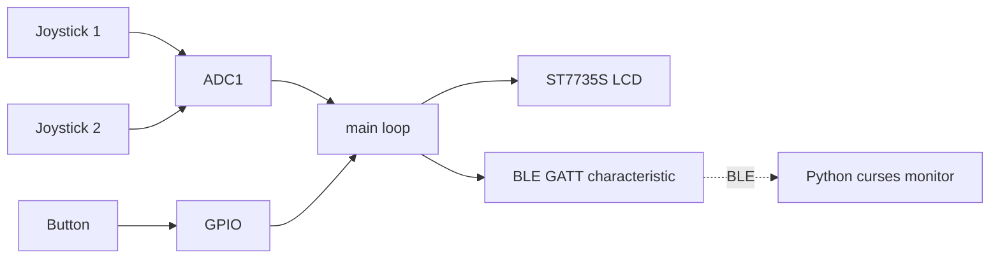

# ESP32-C3 Dual-Joystick BLE Monitor

[](https://github.com/ArseniAliakseichyk/esp32c3-ble-joystick-monitor/actions/workflows/ci.yml)
[](LICENSE)
[](https://docs.espressif.com/projects/esp-idf/en/v5.4/)

Two analog joysticks read by an **ESP32-C3**: their positions are shown live on
an **ST7735S SPI LCD** and broadcast over **BLE** (NimBLE). A companion **Python
terminal app** (`curses` + `bleak`) connects over BLE and renders both sticks in
real time — numbers plus a moving dot in a box for each joystick.

The firmware is split into small modules — `input` (ADC), `ble` (NimBLE GATT),
`lcd` (from-scratch ST7735S driver) and `main` (the glue loop).

---

## Architecture



The main loop reads both joysticks, updates only the values that changed on the
LCD (and a moving dot per stick), and publishes the latest sample to a single
BLE GATT characteristic that the Python client polls.

---

## BLE protocol

| Item               | Value                              |
| ------------------ | ---------------------------------- |
| Device name        | `ESP32-Joystick`                   |
| Service UUID       | `0x1234`                           |
| Characteristic     | `0x5678` (read)                    |
| Payload            | ASCII `x1,y1,x2,y2,sw1`            |

Example payload: `2048,1990,12,4050,1` (joystick raw 0–4095, button 0/1).

---

## Hardware

| Signal           | ESP32-C3 GPIO     |
| ---------------- | ----------------- |
| Joystick 1 X     | GPIO0 (ADC1_CH0)  |
| Joystick 1 Y     | GPIO1 (ADC1_CH1)  |
| Joystick 2 X     | GPIO3 (ADC1_CH3)  |
| Joystick 2 Y     | GPIO2 (ADC1_CH2)  |
| Button (SW1)     | GPIO9 (pull-up)   |
| LCD MOSI         | GPIO4             |
| LCD SCLK         | GPIO5             |
| LCD CS           | GPIO6             |
| LCD DC           | GPIO7             |
| LCD RST          | GPIO8             |

- MCU: ESP32-C3 · BLE stack: NimBLE
- Display: ST7735S SPI LCD, 160×128
- 2× analog joystick modules (X/Y + push button)

---

## Build the firmware

Requires [ESP-IDF v5.4](https://docs.espressif.com/projects/esp-idf/en/v5.4/).

```bash
cd microcontroller-code
idf.py set-target esp32c3
idf.py build
idf.py -p /dev/ttyUSB0 flash monitor
```

## Run the terminal monitor

Needs Python 3.9+ and a BLE adapter.

```bash
cd python-code
pip install -r requirements.txt
python visualization-j.py
```

It scans for `ESP32-Joystick`, connects, and shows both sticks in the terminal.

---

## Project layout

```text
.
├── microcontroller-code/      # ESP-IDF firmware
│   └── main/
│       ├── main.c             # read joysticks -> LCD + BLE
│       ├── input/             # ADC + button
│       ├── ble/               # NimBLE GATT peripheral
│       └── lcd/               # ST7735S driver
└── python-code/
    ├── visualization-j.py     # curses + bleak terminal monitor
    └── requirements.txt
```

## License

MIT — see [LICENSE](LICENSE).
